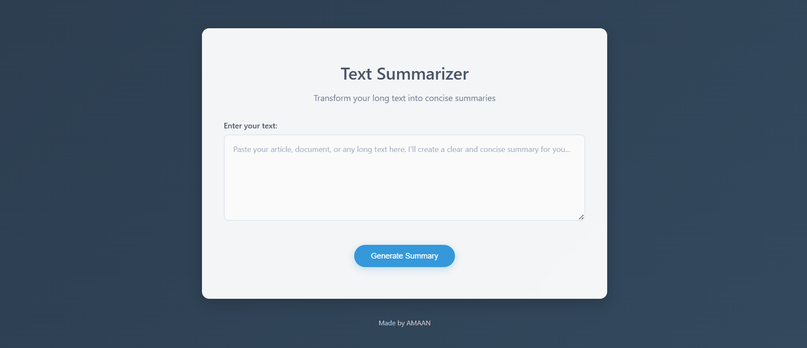
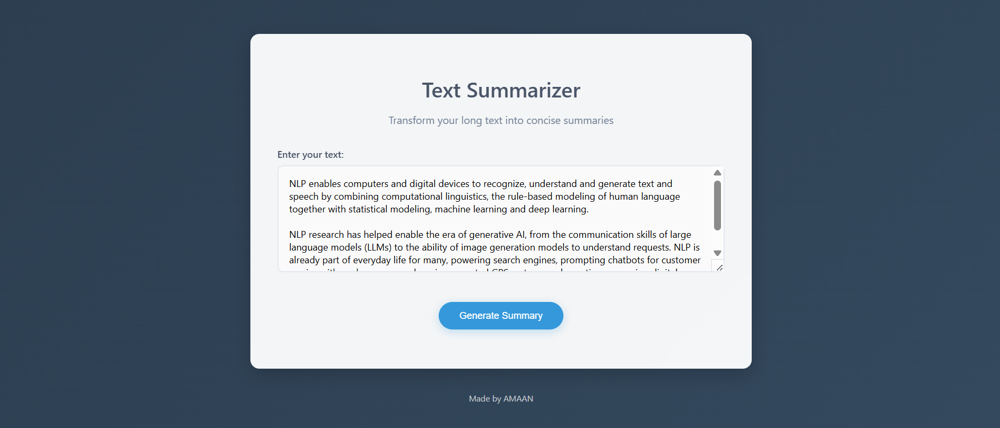
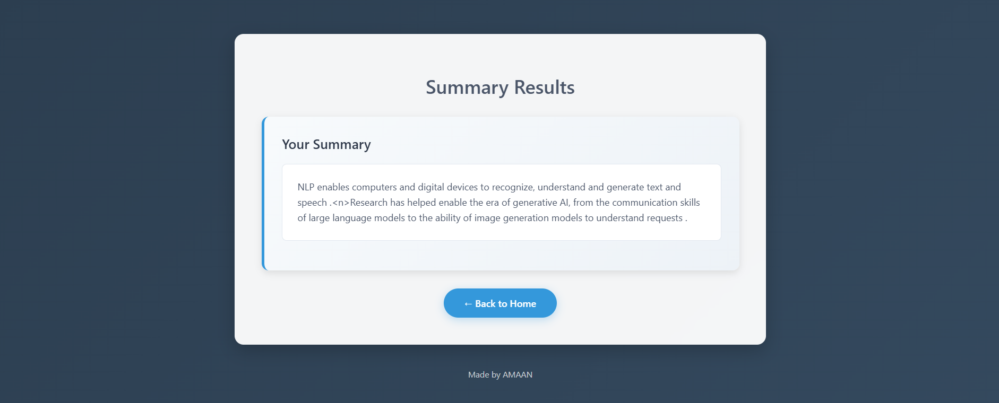
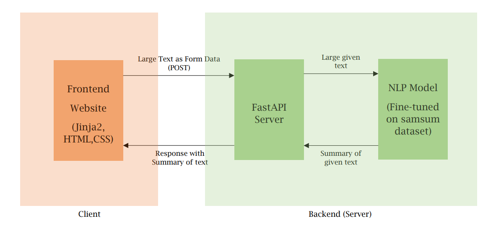

# Text summarizer Web App

Reading long articles or dialogues can be overwhelming, and finding the key points quickly isn’t always easy!

So I present my project, Text Summarizer Web App, an abstractive text summarizer built using Google’s PEGASUS Transformer model, fine-tuned on the SAMSum dataset.
It takes a large block of text as input through a simple web form and returns a concise, meaningful summary generated by my NLP model.

## Technologies Used:
- Python (3.13)

- Hugging Face Transformers

- Jinja2, HTML, CSS (Template for UI)

- FastAPI (Web App)

## Screenshots:

### Home page:

### Summary page:

## Usage:

1. User types or pastes a long text (article, paragraph, or conversation) into the input box.
2. Clicks the Generate Summary button.
3. A new page reloads showing the concise summary generated by the NLP model.
4. Users can also send a POST request to the /predict API endpoint with raw text in JSON format to get the summary programmatically (e.g., via Postman or integration into other apps).

## How It Works:

The PEGASUS model (developed by Google) was fine-tuned on the SAMSum dataset, a dialogue summarization dataset containing thousands of conversations and their human-written summaries. PEGASUS is a Transformer-based sequence-to-sequence model designed specifically for abstractive summarization. Unlike extractive methods that simply pick sentences, PEGASUS generates new, concise sentences that capture the meaning of the text.

During training, the model was optimized using Hugging Face’s Transformers Trainer API, with ROUGE metrics (ROUGE-1, ROUGE-2, ROUGE-L) used to evaluate the quality of generated summaries. The trained model and tokenizer were then wrapped into a Prediction Pipeline, which handles preprocessing, text encoding, summary generation (using beam search and length penalties), and decoding into human-readable text.

The application backend is built with FastAPI. It exposes two interfaces:
- A UI route (/) where the user can paste text into a form and get the summary after clicking the Summarize button.
- An API route (/predict) that accepts JSON input and returns the generated summary, making it possible to test via Postman or integrate with other applications.

The frontend was designed using HTML and CSS, rendered via Jinja2 templates.

## Here's a diagram describing the Data Flow:

## For running on localhost:

- Clone the repository: git clone https://github.com/amaan-ali-1107/text-summarizer.git and navigate to the project folder using cd text-summarizer.

- Create a virtual environment: python -m venv venv and activate it using     venv\Scripts\activate on Windows or source venv/bin/activate on macOS/Linux.

- Install the required dependencies: pip install -r requirements.txt.

- Run the FastAPI application: python app.py.

- Open your browser and go to http://127.0.0.1:8080 to use the app locally.

## Challenges Faced and Things Learned:

Since this was my first NLP project, getting everything to work together was quite a challenge. I first had to understand abstractive summarization itself, the difference from extractive methods, and why models like PEGASUS are particularly suited for this task. I learned how the gap-sentence generation pretraining objective makes PEGASUS effective for generating human-like summaries, and how fine-tuning on a dataset like SAMSum improves its ability to handle conversational text. Training and evaluation with Hugging Face’s Trainer API also introduced me to metrics like ROUGE, which helped me measure the quality of the summaries in a more structured way.

One of the major issues I faced was with performance during template loading. When I first implemented a multi-page design, the first summary request was significantly slower compared to subsequent requests. After investigating, I discovered that this was due to Jinja2 templates being compiled on the first request. To solve this, I preloaded and cached the templates during the application startup using FastAPI’s startup_event. This reduced the first-request latency by nearly 50% and gave me a much better understanding of how template handling works in production applications.

Finally, I wanted the app to serve both end users and developers, which meant I had to design both a simple UI and a REST API. Finding the right balance between the two was tricky at first, but by keeping the UI routes (/ and /summarize) separate from the API route (/predict), I managed to support both use cases cleanly. This experience gave me confidence in designing hybrid applications that combine ML, APIs, and UI elements.